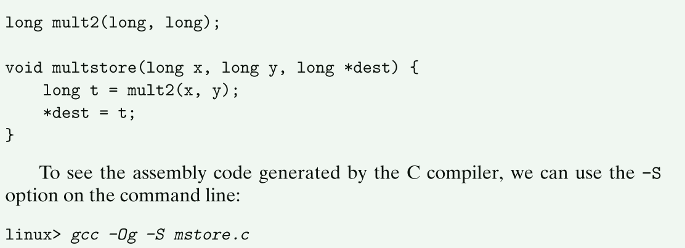
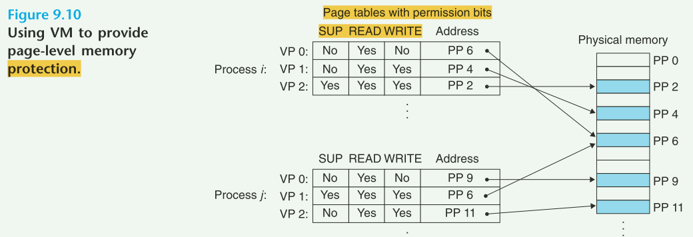

《Computer Systems: A Programmer's Perspective》 reading records


### 1.7 operating systems 2 primary purposes

1）protect the hardware form misuse by applications

2）provide applications with simple and uniform mechanisms for manipulating hardware devices

### 1.7.1 Processes

  

### 1.7.2 Threads

process can be consist of multiple threads.

it's easier to share data between multiple threads than between multiple processes.

### 1.7.3 Virtual Memory

Each process has same uniform view of memory, which known as its virtual address space.  

 

Program code and data： code start from same fixed address for all processes.

Heap: not fixed size. dynamically at run time as a result of calls to c lib such as  malloc and free.

### 1.7.4 Files

All I/O devices are modeled as files.

### 1.9 Concurrency and parrallelism


### 2.3 Two's-complement Encodings

  


  

    


mystore.c

  


  

   


.o file and binary file:

 

  

  

  

  

  

  


 

  

  

 


## 7 Linking

### 7.1 Compiler Drivers


   

```shell
linux> gcc -Og -o prog main.c sum.c
```

  

compile steps:

```shell
cpp [other arguments] main.c /tmp/main.i  # replace include with file content
cc1 /tmp/main.i -Og [other arguments] -o /tmp/main.s #translate it into an ASCII assembly-language file
as [other arguments] -o /tmp/main.o /tmp/main.s #assembler translate main.s to main.o
ld -o prog [system object files and args] /tmp/main.o /tmp/sum.o #combine main.o and sum.o, along with system the necessary system object files, to create bin exe object file
linux> ./prog
```


### 7.2 static linking

take as input a collection of relocatable object files and command-line arguments and generate as a output a fully linked executable object file that can be loaded and run.

linker build executable with 2 steps:

1. **Symbol resolution**: associate each symbol reference with exactly one symbol definition
2. **Relocation**: linker relocates sections(code, data) by associating memory location with each symbol definition, and then modifying all of the references to those symbols so that they point to this memory location.

### 7.3 Relocatable Object files

  

  

  

### 7.5 Symbols and symbol tables


## 9 Virtual memory

### 9.1 Physical and Virtual Address

  


Virtual address--> dedicated hardware on CPU chip called MMU(memory management unit)--->Physical address


### 9.3 VM as a Tool for Caching

#### 9.3.4 Page Faults

swapping/paging: transfer a page between disk and Dram

swapped in: pages are swapped in from disk to DRAM

swapping out: pases are swapped out from DRAM to disk

  


#### 9.3.5 Allocating pages

  

  


#### 9.3.6 Address Translating

  


 


  


### 9.5 VM as a Tool for Memory Protection

  


### 9.8 Memory mapping

Virtual memory areas can be mapped to one of **two types of objects:**

- Regular file in the Linux file system

such as executable object file. The file section is divided into page-size pieces, with each piece containing the initial contents of a virtual page.

- Anonymous file

created by kernel, that contains all binary zeros.

the first time the CPU touches a virtual page in such an area, the kernel finds an appropriate victim page in physical memory, swaps out the victim page if it is dirty, overwrites the page with binary zeros, and update page table to mark the page as resident.


**swap space**(maintained by the kernel) bounds the total amount of virtual pages that can be allocated by the currently running processes.


#### 9.8.1 shared objects revisited

An object can be mapped into an area of virtual memory as either a **shared object** or a **private object**.

**shared object**: any process make change to the object, other process will see the change.

**private object**: any process make change to the object, other process can not see the change.

 


 

 


copy-on-write: different process share a same object with read only permission. When one process want to write on this object, then copy a new one and write to new object.

#### 9.8.2 The fork Function revisited

current process-->fork: create copies of current porcess's **mm_struct, area structs, and page tables.**

#### 9.8.3 The execve Function revisited

```
execve("a.out", NULL, NULL);
```


 

1. delete existing user areas

2. map private areas

3. map shared areas

4. set the program counter(PC)

   

#### 9.8.4 User-level memory mapping with the mmap function

Linux process can use mmap to map an object into a new area of virtual memory

   

start: start address is merely a hint. and is usually specified as NULL.

port: permission of mapped virtual memory area.

- PROT_EXEC: pages in the area consist of instructions that may be executed by the CPU
- PROT_READ: Pages in the area may be read.
- PROT_WRITE: Pages in the area may be written.
- PROT_NONE: Pages in the area cannnot be accessed.

flags: the type of mapped object.

- MAP_ANON: anonymous object, virtual pages are demand-zero.
- MAP_PRIVATE: private copy-on-write object
- MAP_SHARED: shared object

```
bufp = Mmap(NULL, size, PROT_READ, MAP_PRIVATE|MAP_ANON, 0, 0);
```

delete the area: munmap delete the area starting at virtual address start with length bytes.

 


### 9.9 Dynamic memroy allocation

A dynamic memory allocator maintains an area of process's virtual memory known as heap.

**heap:** an area of demand-zero memory that begins immediately after the uninitialized data and grows upward(toward higher addresses.) 

for each process, the kernel maintains a variable **brk** that points to the top of the heap.

  


Allocators come in two basic styles:

Explicit allocators:  malloc and free. new and delete(c++)

Implicit allocators:  garbage collectors.

#### 9.9.1 The malloc and free Functions

  

**malloc:** return **at least size bytes** that is suitably aligned for any kind of data object that might be contained in the block.

**malloc:** does not initialize the memory it returns.

**calloc**: a thin wrapper around the malloc function that **initializes the allocated memory to zero**.

**realloc:** change size of previously allocated block

**sbrk:** grows or shrinks the heap by adding incr to the kernel's brk pointer.


 

#### 9.9.2 why dynamic memory allocation?


#### 9.9.4 Fragmentation


### 9.12 Summary 

Virtual memory, 3 important capabilities:

1) **caches** recently used contents of the virtual address space stored on disk in main memory

   **page fault:**  a reference to a page on disk triggers a page fault that transfers control to a fault handler in the operating system.

2. **simplifies memory management**, which in turn simplifies linking, sharing data between processes, the allocation of memory for processes, and program loading.

3.  **simplifies memory protection** by incorporating protection bits into every page table entry.

   

**mmap**: create and delete areas of virtual memory.

**malloc**: manages memory in an area of the virutal address space called the **heap**

dynamic memory allocators are application-level programs with a system-level feel, directly manipulating memory without much help from the type system.

**Allocators** come in two flavors: **Explicit allocators/ Implicit allocators**

