## 1 背景知识

进程process p：

 thread a

 thread b


**thread ab可共享进程p的数据：**

- 全局变量
- 堆数据
- 函数里的静态变量
- 程序代码，任何线程都有权利读取并执行任何代码
- 打开的文件，A线程打开的文件可由B线程读写

  

**thread的私有空间：**

- 局部变量
- 栈
- 函数的参数
- TLS（线程局部存储）
- 寄存器


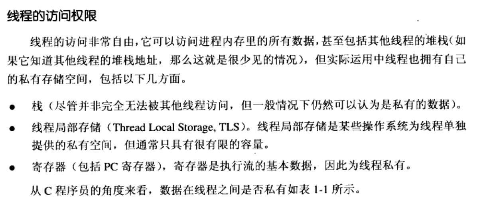    


fork一个进程，linux采用写时复制。因此在只读的情况下fork进程特别快。

fork：产生本任务的镜像，exec启动新任务。

clone：产生新的线程，从指定位置开始执行，(可选的)共享当前进程的内存空间、文件等。实际效果上产生一个线程。

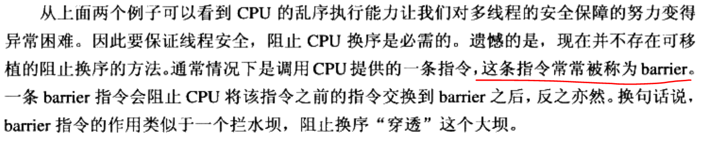  

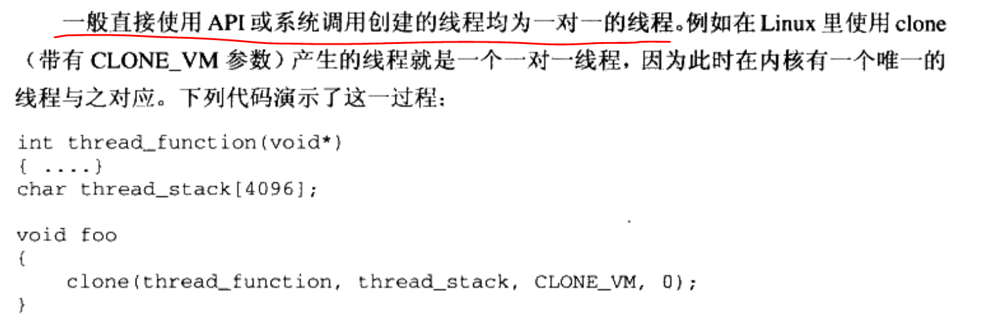  


## 2  静态链接

gcc hello.c  

a.out

上述过程分解为4个步骤：预处理、编译、汇编、链接

### 2.1 看不见的过程

#### 2.1.1 预编译：

- 展开宏定义

- 替换include为文件内容，此处可能会递归调用

- 处理条件预编译指令，例如“#if”、“#ifdef”、“#elif”、“#else”、“endif”

- 删除所有的注释：“//”和“/* */”

- 添加行号和文件名标识，比如#2 "hello.c" 2, 以便于编译时产生调试用的行号信息以及用于编译时产生编译错误或者警告时能够显示行号

- 保留所有#pragma编译器指令

  

```
gcc -E hello.c -o hello.i
```

  

#### 2.1.2 编译

把预处理完的文件---------------(**词法分析、语法分析、语义分析及优化后)**--------------->生成汇编代码

```
gcc -S hello.i -o hello.s
cat hello.s
        .file   "hello.c"
        .text
        .globl  main
        .type   main, @function
main:
.LFB0:
        .cfi_startproc
        pushq   %rbp
        .cfi_def_cfa_offset 16
        .cfi_offset 6, -16
        movq    %rsp, %rbp
        .cfi_def_cfa_register 6
        movl    $0, %eax
        popq    %rbp
        .cfi_def_cfa 7, 8
        ret
        .cfi_endproc
.LFE0:
        .size   main, .-main
        .ident  "GCC: (Ubuntu 7.5.0-3ubuntu1~18.04) 7.5.0"
        .section        .note.GNU-stack,"",@progbits

```

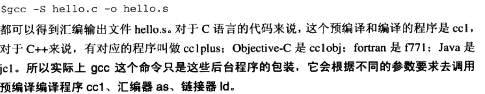  


#### 2.1.3 汇编

汇编代码S -----> 机器可执行的指令

```
gcc -c hello.s -o hello.o
```

#### 2.1.4 链接

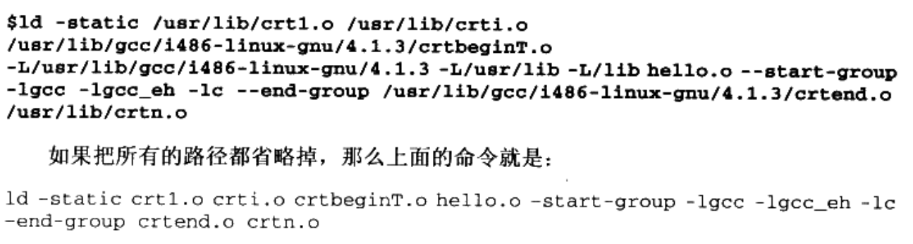  

### 2.2 编译器

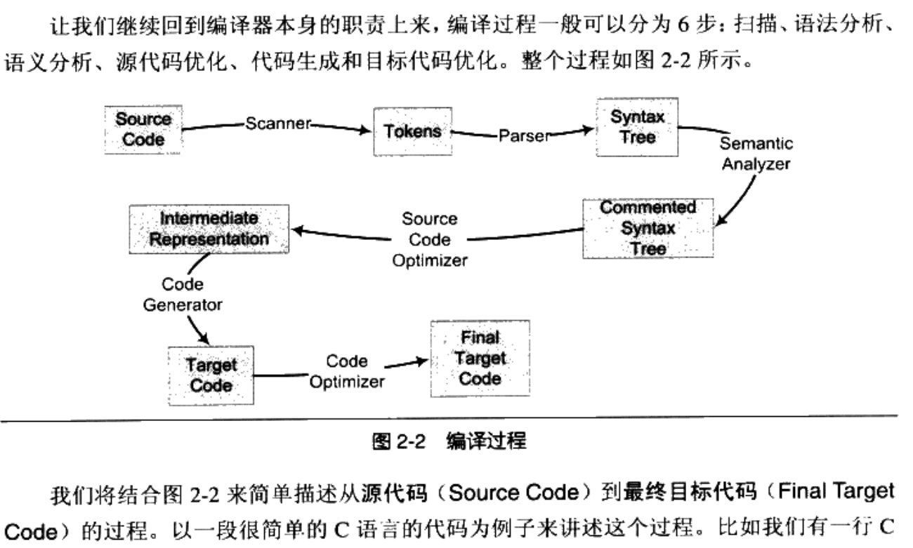  

#### 2.2.1 词法分析

使用有限状态机的算法将源代码字符序列分割成一系列token。

词法分析产生的记号一般可分为以下几类：

关键字、标识符、字面量（数字、字符串）、特殊符号（+、=）


词法扫描现有工具：lex。根据词法规则将输入字符串分割成一个个记号。

C语言宏替换和文件包含等工作一般交给一个独立的预处理器

#### 2.2.2 语法分析

语法分析器产生语法树。分析过程采用上下文无关语法的分析手段。

语法分析现有工具：yacc。根据语法规则进行解析构造一颗语法树

#### 2.2.3 语义分析

静态语义：编译期就可以确定的语义。通常包括声明和类型的匹配，类型的转换。

动态语义：程序执行时才能确定的语义

编译器分析静态语义，比如一个浮点数赋值给整型表达式时，隐含包含了一个浮点型到整型的转换过程。类型转换是否合法。经过语义分析阶段后语法树表达式都被标识了类型。如果有些类型需要语法转换，则语义分析程序会在语法树中插入相应的转换节点。

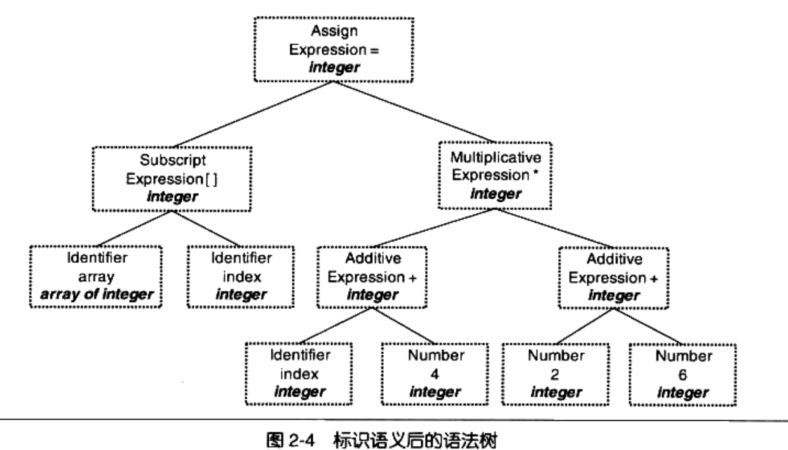  

#### 2.2.4 链接

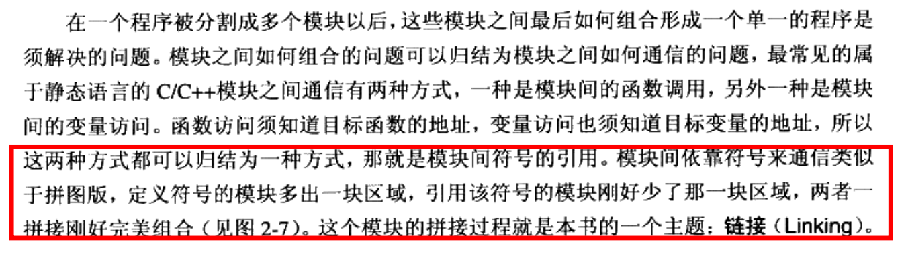  

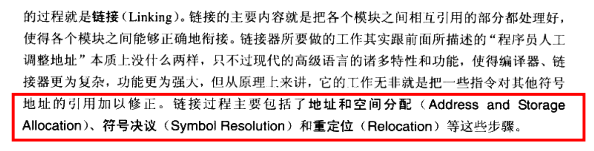  


## 3 可执行文件

```shell
// -h打印各个段的基本信息
objdump -h hello.o

hello.o:     file format elf64-x86-64

Sections:
Idx Name          Size      VMA               LMA               File off  Algn
  0 .text         00000017  0000000000000000  0000000000000000  00000040  2**0
                  CONTENTS, ALLOC, LOAD, RELOC, READONLY, CODE
  1 .data         00000000  0000000000000000  0000000000000000  00000057  2**0
                  CONTENTS, ALLOC, LOAD, DATA
  2 .bss          00000000  0000000000000000  0000000000000000  00000057  2**0
                  ALLOC
  3 .rodata       0000000c  0000000000000000  0000000000000000  00000057  2**0
                  CONTENTS, ALLOC, LOAD, READONLY, DATA
  4 .comment      0000002a  0000000000000000  0000000000000000  00000063  2**0
                  CONTENTS, READONLY
  5 .note.GNU-stack 00000000  0000000000000000  0000000000000000  0000008d  2**0
                  CONTENTS, READONLY
  6 .eh_frame     00000038  0000000000000000  0000000000000000  00000090  2**3
                  CONTENTS, ALLOC, LOAD, RELOC, READONLY, DATA

                  
// -x打印更详细的内容
 objdump -x hello.o

hello.o:     file format elf64-x86-64
hello.o
architecture: i386:x86-64, flags 0x00000011:
HAS_RELOC, HAS_SYMS
start address 0x0000000000000000

Sections:
Idx Name          Size      VMA               LMA               File off  Algn
  0 .text         00000017  0000000000000000  0000000000000000  00000040  2**0
                  CONTENTS, ALLOC, LOAD, RELOC, READONLY, CODE
  1 .data         00000000  0000000000000000  0000000000000000  00000057  2**0
                  CONTENTS, ALLOC, LOAD, DATA
  2 .bss          00000000  0000000000000000  0000000000000000  00000057  2**0
                  ALLOC
  3 .rodata       0000000c  0000000000000000  0000000000000000  00000057  2**0
                  CONTENTS, ALLOC, LOAD, READONLY, DATA
  4 .comment      0000002a  0000000000000000  0000000000000000  00000063  2**0
                  CONTENTS, READONLY
  5 .note.GNU-stack 00000000  0000000000000000  0000000000000000  0000008d  2**0
                  CONTENTS, READONLY
  6 .eh_frame     00000038  0000000000000000  0000000000000000  00000090  2**3
                  CONTENTS, ALLOC, LOAD, RELOC, READONLY, DATA
SYMBOL TABLE:
0000000000000000 l    df *ABS*  0000000000000000 hello.c
0000000000000000 l    d  .text  0000000000000000 .text
0000000000000000 l    d  .data  0000000000000000 .data
0000000000000000 l    d  .bss   0000000000000000 .bss
0000000000000000 l    d  .rodata        0000000000000000 .rodata
0000000000000000 l    d  .note.GNU-stack        0000000000000000 .note.GNU-stack
0000000000000000 l    d  .eh_frame      0000000000000000 .eh_frame
0000000000000000 l    d  .comment       0000000000000000 .comment
0000000000000000 g     F .text  0000000000000017 main
0000000000000000         *UND*  0000000000000000 _GLOBAL_OFFSET_TABLE_
0000000000000000         *UND*  0000000000000000 puts


RELOCATION RECORDS FOR [.text]:
OFFSET           TYPE              VALUE
0000000000000007 R_X86_64_PC32     .rodata-0x0000000000000004
000000000000000c R_X86_64_PLT32    puts-0x0000000000000004


RELOCATION RECORDS FOR [.eh_frame]:
OFFSET           TYPE              VALUE
0000000000000020 R_X86_64_PC32     .text


// 以十六进制打印hello.o所有段的内容
objdump -s hello.o
hello.o:     file format elf64-x86-64

Contents of section .text:
 0000 554889e5 488d3d00 000000e8 00000000  UH..H.=.........
 0010 b8000000 005dc3                      .....].
Contents of section .rodata:
 0000 68656c6c 6f20776f 726c6400           hello world.
Contents of section .comment:
 0000 00474343 3a202855 62756e74 7520372e  .GCC: (Ubuntu 7.
 0010 352e302d 33756275 6e747531 7e31382e  5.0-3ubuntu1~18.
 0020 30342920 372e352e 3000               04) 7.5.0.
Contents of section .eh_frame:
 0000 14000000 00000000 017a5200 01781001  .........zR..x..
 0010 1b0c0708 90010000 1c000000 1c000000  ................
 0020 00000000 17000000 00410e10 8602430d  .........A....C.
 0030 06520c07 08000000                    .R......

// 以十六进制打印hello.o所有段的内容。且“-d”对内容进行反汇编
objdump -s -d hello.o

hello.o:     file format elf64-x86-64

Contents of section .text:
 0000 554889e5 488d3d00 000000e8 00000000  UH..H.=.........
 0010 b8000000 005dc3                      .....].
Contents of section .rodata:
 0000 68656c6c 6f20776f 726c6400           hello world.
Contents of section .comment:
 0000 00474343 3a202855 62756e74 7520372e  .GCC: (Ubuntu 7.
 0010 352e302d 33756275 6e747531 7e31382e  5.0-3ubuntu1~18.
 0020 30342920 372e352e 3000               04) 7.5.0.
Contents of section .eh_frame:
 0000 14000000 00000000 017a5200 01781001  .........zR..x..
 0010 1b0c0708 90010000 1c000000 1c000000  ................
 0020 00000000 17000000 00410e10 8602430d  .........A....C.
 0030 06520c07 08000000                    .R......

Disassembly of section .text:

0000000000000000 <main>: // 左边一列偏移量。 中间十六进制表示，右边ascii码表示
   0:   55                      push   %rbp
   1:   48 89 e5                mov    %rsp,%rbp
   4:   48 8d 3d 00 00 00 00    lea    0x0(%rip),%rdi        # b <main+0xb>
   b:   e8 00 00 00 00          callq  10 <main+0x10>
  10:   b8 00 00 00 00          mov    $0x0,%eax
  15:   5d                      pop    %rbp
  16:   c3                      retq

```


printf里的字符串为常量，放到rodata里，```rodata       0000000c``` 可以看到该字符串12字节长度。

rodata：只读数据。一般用来存储全局const常量或者字符串常量。

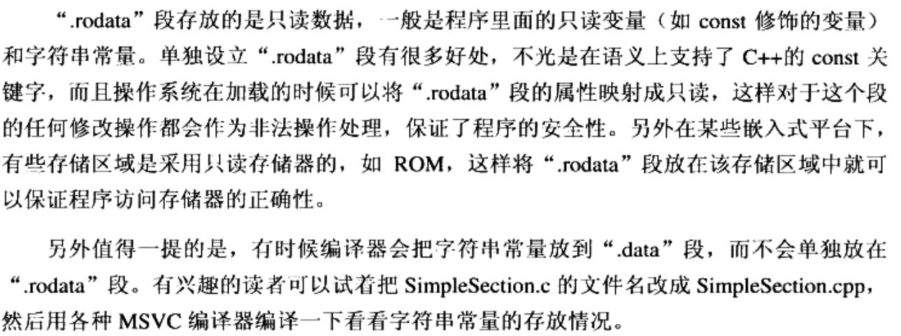  

### 3.4 ELF文件结构描述

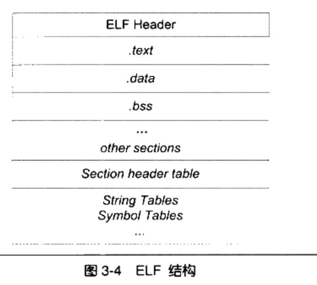  


#### 3.4.1 文件头

```
 readelf -h hello.o
ELF Header:
  Magic:   7f 45 4c 46 02 01 01 00 00 00 00 00 00 00 00 00
  Class:                             ELF64
  Data:                              2's complement, little endian // 数据存储方式
  Version:                           1 (current)
  OS/ABI:                            UNIX - System V
  ABI Version:                       0
  Type:                              REL (Relocatable file)
  Machine:                           Advanced Micro Devices X86-64
  Version:                           0x1
  Entry point address:               0x0
  Start of program headers:          0 (bytes into file)
  Start of section headers:          760 (bytes into file)
  Flags:                             0x0
  Size of this header:               64 (bytes)
  Size of program headers:           0 (bytes)
  Number of program headers:         0
  Size of section headers:           64 (bytes)
  Number of section headers:         13
  Section header string table index: 12
```

#### 3.4.2 符号

```
// 显示符号表信息。变量和函数都是符号
readelf -s hello.o

Symbol table '.symtab' contains 13 entries:
   Num:    Value          Size Type    Bind   Vis      Ndx Name
     0: 0000000000000000     0 NOTYPE  LOCAL  DEFAULT  UND
     1: 0000000000000000     0 FILE    LOCAL  DEFAULT  ABS hello.c
     2: 0000000000000000     0 SECTION LOCAL  DEFAULT    1
     3: 0000000000000000     0 SECTION LOCAL  DEFAULT    3
     4: 0000000000000000     0 SECTION LOCAL  DEFAULT    4
     5: 0000000000000000     0 SECTION LOCAL  DEFAULT    5
     6: 0000000000000000     0 SECTION LOCAL  DEFAULT    7
     7: 0000000000000000     0 SECTION LOCAL  DEFAULT    8
     8: 0000000000000000     0 SECTION LOCAL  DEFAULT    6
     9: 0000000000000000     4 OBJECT  GLOBAL DEFAULT    3 global_init_var
    10: 0000000000000000    23 FUNC    GLOBAL DEFAULT    1 main
    11: 0000000000000000     0 NOTYPE  GLOBAL DEFAULT  UND _GLOBAL_OFFSET_TABLE_
    12: 0000000000000000     0 NOTYPE  GLOBAL DEFAULT  UND puts
```


## 6 可执行文件的装载

静态编译成elf文件，然后查看信息

```shell
gcc -static hello.o -o hello.elf
readelf -S hello.elf
There are 33 section headers, starting at offset 0xcdda0:

Section Headers:
  [Nr] Name              Type             Address           Offset
       Size              EntSize          Flags  Link  Info  Align
  [ 0]                   NULL             0000000000000000  00000000
       0000000000000000  0000000000000000           0     0     0
  [ 1] .note.ABI-tag     NOTE             0000000000400190  00000190
       0000000000000020  0000000000000000   A       0     0     4
  [ 2] .note.gnu.build-i NOTE             00000000004001b0  000001b0
       0000000000000024  0000000000000000   A       0     0     4
readelf: Warning: [ 3]: Link field (0) should index a symtab section.
  [ 3] .rela.plt         RELA             00000000004001d8  000001d8
       0000000000000228  0000000000000018  AI       0    20     8
  [ 4] .init             PROGBITS         0000000000400400  00000400
       0000000000000017  0000000000000000  AX       0     0     4
  [ 5] .plt              PROGBITS         0000000000400418  00000418
       00000000000000b8  0000000000000000  AX       0     0     8
  [ 6] .text             PROGBITS         00000000004004d0  000004d0
       000000000008f640  0000000000000000  AX       0     0     16
  [ 7] __libc_freeres_fn PROGBITS         000000000048fb10  0008fb10
       0000000000001523  0000000000000000  AX       0     0     16
  [ 8] __libc_thread_fre PROGBITS         0000000000491040  00091040
       00000000000010eb  0000000000000000  AX       0     0     16
  [ 9] .fini             PROGBITS         000000000049212c  0009212c
       0000000000000009  0000000000000000  AX       0     0     4
  [10] .rodata           PROGBITS         0000000000492140  00092140
       000000000001926c  0000000000000000   A       0     0     32
  [11] .stapsdt.base     PROGBITS         00000000004ab3ac  000ab3ac
       0000000000000001  0000000000000000   A       0     0     1
  [12] .eh_frame         PROGBITS         00000000004ab3b0  000ab3b0
       000000000000a5e8  0000000000000000   A       0     0     8
  [13] .gcc_except_table PROGBITS         00000000004b5998  000b5998
       000000000000009e  0000000000000000   A       0     0     1
  [14] .tdata            PROGBITS         00000000006b6120  000b6120
       0000000000000020  0000000000000000 WAT       0     0     8
  [15] .tbss             NOBITS           00000000006b6140  000b6140
       0000000000000040  0000000000000000 WAT       0     0     8
  [16] .init_array       INIT_ARRAY       00000000006b6140  000b6140
       0000000000000010  0000000000000008  WA       0     0     8
  [17] .fini_array       FINI_ARRAY       00000000006b6150  000b6150
       0000000000000010  0000000000000008  WA       0     0     8
  [18] .data.rel.ro      PROGBITS         00000000006b6160  000b6160
       0000000000002d94  0000000000000000  WA       0     0     32
  [19] .got              PROGBITS         00000000006b8ef8  000b8ef8
       00000000000000f8  0000000000000000  WA       0     0     8
  [20] .got.plt          PROGBITS         00000000006b9000  000b9000
       00000000000000d0  0000000000000008  WA       0     0     8
  [21] .data             PROGBITS         00000000006b90e0  000b90e0
       0000000000001af0  0000000000000000  WA       0     0     32
  [22] __libc_subfreeres PROGBITS         00000000006babd0  000babd0
       0000000000000048  0000000000000000  WA       0     0     8
  [23] __libc_IO_vtables PROGBITS         00000000006bac20  000bac20
       00000000000006a8  0000000000000000  WA       0     0     32
  [24] __libc_atexit     PROGBITS         00000000006bb2c8  000bb2c8
       0000000000000008  0000000000000000  WA       0     0     8
  [25] __libc_thread_sub PROGBITS         00000000006bb2d0  000bb2d0
       0000000000000008  0000000000000000  WA       0     0     8
  [26] .bss              NOBITS           00000000006bb2e0  000bb2d8
       00000000000016f8  0000000000000000  WA       0     0     32
  [27] __libc_freeres_pt NOBITS           00000000006bc9d8  000bb2d8
       0000000000000028  0000000000000000  WA       0     0     8
  [28] .comment          PROGBITS         0000000000000000  000bb2d8
       0000000000000029  0000000000000001  MS       0     0     1
  [29] .note.stapsdt     NOTE             0000000000000000  000bb304
       0000000000001638  0000000000000000           0     0     4
  [30] .symtab           SYMTAB           0000000000000000  000bc940
       000000000000a9b0  0000000000000018          31   679     8
  [31] .strtab           STRTAB           0000000000000000  000c72f0
       0000000000006938  0000000000000000           0     0     1
  [32] .shstrtab         STRTAB           0000000000000000  000cdc28
       0000000000000176  0000000000000000           0     0     1
Key to Flags:
  W (write), A (alloc), X (execute), M (merge), S (strings), I (info),
  L (link order), O (extra OS processing required), G (group), T (TLS),
  C (compressed), x (unknown), o (OS specific), E (exclude),
  l (large), p (processor specific)
  

readelf -l hello.elf

Elf file type is EXEC (Executable file)
Entry point 0x400a50
There are 6 program headers, starting at offset 64

Program Headers:
  Type           Offset             VirtAddr           PhysAddr
                 FileSiz            MemSiz              Flags  Align
  LOAD           0x0000000000000000 0x0000000000400000 0x0000000000400000
                 0x00000000000b5a36 0x00000000000b5a36  R E    0x200000
  LOAD           0x00000000000b6120 0x00000000006b6120 0x00000000006b6120
                 0x00000000000051b8 0x00000000000068e0  RW     0x200000
  NOTE           0x0000000000000190 0x0000000000400190 0x0000000000400190
                 0x0000000000000044 0x0000000000000044  R      0x4
  TLS            0x00000000000b6120 0x00000000006b6120 0x00000000006b6120
                 0x0000000000000020 0x0000000000000060  R      0x8
  GNU_STACK      0x0000000000000000 0x0000000000000000 0x0000000000000000
                 0x0000000000000000 0x0000000000000000  RW     0x10
  GNU_RELRO      0x00000000000b6120 0x00000000006b6120 0x00000000006b6120
                 0x0000000000002ee0 0x0000000000002ee0  R      0x1

 Section to Segment mapping:
  Segment Sections...
   00     .note.ABI-tag .note.gnu.build-id .rela.plt .init .plt .text __libc_freeres_fn __libc_thread_freeres_fn .fini .rodata .stapsdt.base .eh_frame .gcc_except_table
   01     .tdata .init_array .fini_array .data.rel.ro .got .got.plt .data __libc_subfreeres __libc_IO_vtables __libc_atexit __libc_thread_subfreeres .bss __libc_freeres_ptrs
   02     .note.ABI-tag .note.gnu.build-id
   03     .tdata .tbss
   04
   05     .tdata .init_array .fini_array .data.rel.ro .got

```

动态链接：**运行时**才将用到的lib so进行链接

静态链接：将所有模块使用的文件都链接到一起，形成一个可执行文件


动态链接好处：兼容性和扩展性

动态链接坏处：模块更新后，旧的模块接口和新模块接口不兼容则容易出现程序无法跑的情况


动态链接文件：dynamic shared objects。so文件

windows 动态链接文件：dll


判断dso是否为PIC文件

```shell
gcc -fPIC hello.c -o hello.so
readelf -d hello.so | grep TEXTREL //无输出则是PIC文件。PIC不包含段重定位表
```


## 10 栈

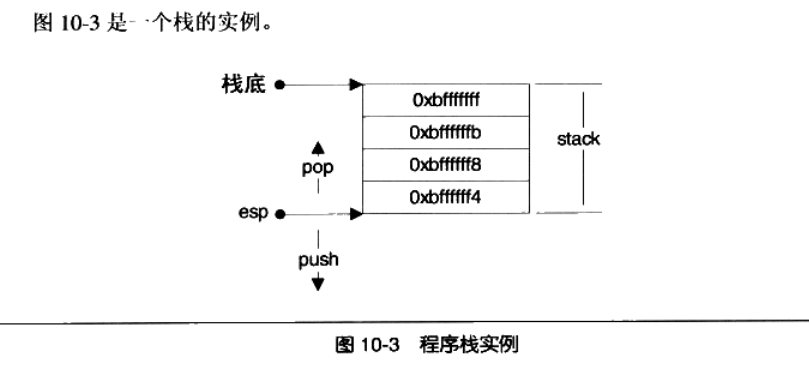  


## 12 系统调用与API

cpu规格：

100MHZ： 每1s CPU可执行100000000个指令周期

1000MHZ: 每1s CPU可执行1000个指令周期

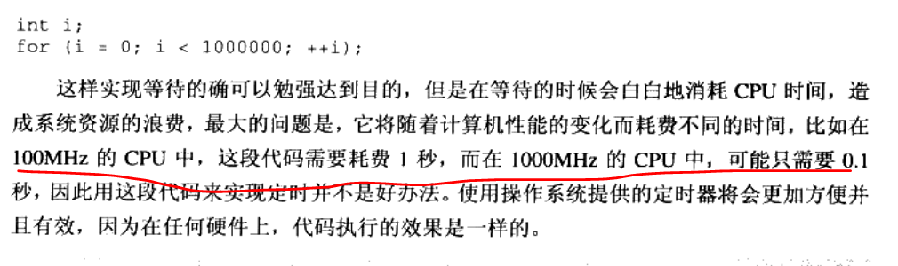