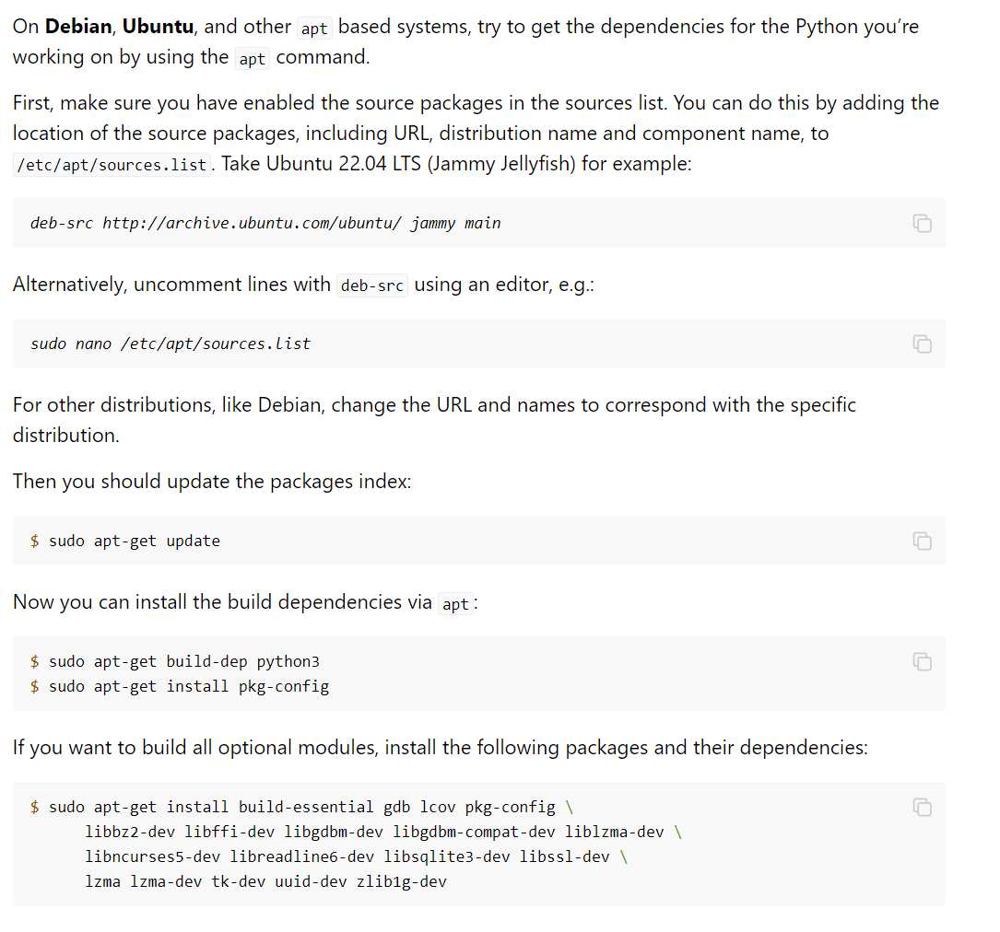

##  env

env: ubuntu 1804

## guide

1. git clone cpython from github

2. cd cpython-main and run commands:  ref(https://devguide.python.org/)

```
./configure --with-pydebug && make -j
```

2.1 some errors occur, remind us some modules need to be installed:

found the guide from https://devguide.python.org/getting-started/setup-building/#install-dependencies



run this command, some error occurs 

```
sudo apt-get build-dep python3
Reading package lists... Done
Picking 'python3-defaults' as source package instead of 'python3'
Reading package lists... Done
Building dependency tree       
Reading state information... Done
Some packages could not be installed. This may mean that you have
requested an impossible situation or if you are using the unstable
distribution that some required packages have not yet been created
or been moved out of Incoming.
The following information may help to resolve the situation:

The following packages have unmet dependencies:
 builddeps:python3-defaults : Depends: python3.10 (>= 3.10.4-1~) but it is not installable
E: Unable to correct problems, you have held broken packages.

sudo apt --fix-broken install// run this to solve
sudo apt upgrade
```

```
sudo apt-get install build-essential gdb lcov pkg-config \
      libbz2-dev libffi-dev libgdbm-dev libgdbm-compat-dev liblzma-dev \
      libncurses5-dev libreadline6-dev libsqlite3-dev libssl-dev \
      lzma lzma-dev tk-dev uuid-dev zlib1g-dev
```

run this command, and tk-dev can not be installed